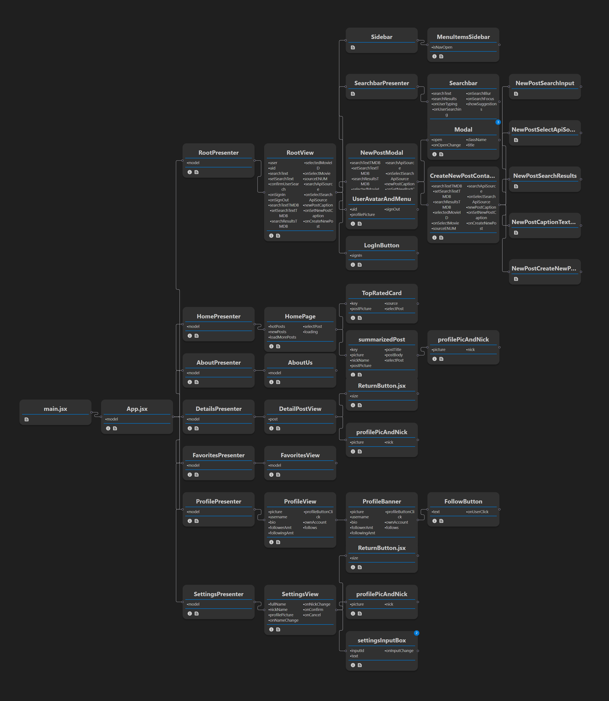

# FirePins - Share Your Favorites

"FirePins" is a unique social networking project developed as part of the "Interaction Programming and the Dynamic Web (iprogdh)" course. This platform allows users to explore and share their favorite movies in an interactive and engaging way. By integrating with the TMDB (The Movie Database) API, users can search for movies, add personal captions, and share these finds on FirePins, creating a vibrant community of movie enthusiasts.

Currently, the project features TMDB API integration. Future plans, time permitting, include incorporating APIs from Unsplash and Pinterest, expanding the range of sharable content. Google's Single Sign-On is used for Authentication, ensuring a seamless user experience.

### Deployed App

[FirePins Web App](https://dh2642-gp45.web.app/)

---

### Dom Tree

The image below represents how the React components are connected to each other.

---

### The Models

#### `model` Directory

- `firePinsModel`
- `initialiseModel`

#### `firebase` Directory

- `firebaseConfig`
- `firebaseModel`

---

### Third Party Services

#### `services` Directory

- `apiConfig`
- `firePinsSource`
- `resolvePromise`
- `teacherFetch`

---

### What we still plan to do

- Like & Dislike
- Comments
- Custom biography & profile pictures
- Unsplash & Pinterest API

---

## Getting Started

To get started with "FirePins", follow these steps:

1. **Clone the Repository**

   - Clone the project to your local machine using `git clone https://github.com/DaGigabyte/DH2642_Gp45.git`.

2. **Install Dependencies**

   - Navigate to the project directory and run `npm install` to install all the necessary dependencies.

3. **Set Up Environment Variables**

   - Ensure you have the necessary API keys and environment variables set up, especially for the TMDB API and Firebase (They should be included in this project).

4. **Run the Development Server**

   - Start the development server by running `npm run dev` (since this is a Vite project, Vite commands are used instead of the traditional React scripts).
   - The app should now be running on `http://localhost:8080` or another port if 8080 is busy.

5. **Open and Explore**
   - Open your browser and navigate to the running application to start exploring and using "FirePins".

---
